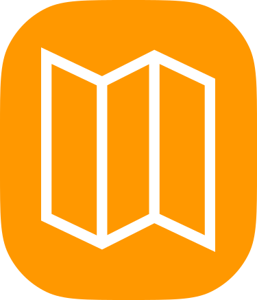

# oua_flutter_eight

# MEKAN

Seyahat tutkunları, hazır olun: Yerel Gezginlerin vazgeçilmezi, Türkiye'nin kültürel ve tarihi zenginliklerini keşfetmek için yeni bir yol!

MEKAN, Türkiye'nin derinliklerine ulaşmanın ve eşsiz anlarınızı yaşamanın yeni yolu. Bu muhteşem uygulama ile, Türkiye'nin her köşesindeki kültürel ve tarihi mekanları keşfedin. Efsanevi yapıları, gizli kalmış tarihi dokuları, unutulmaz manzaraları bulun!

## Özellikler

- **Kendi Özel Gezi Rotanızı Oluşturun:** Planlarınızı kişiselleştirin ve istediğiniz yerleri ziyaret edin.
- **Detaylı Bilgiler:** Her mekanın açıklamalarını, fotoğraflarını ve hatta videolarını görüntüleyin.
- **Kolay Kullanım:** Basit arayüzü ile MEKAN, seyahat deneyiminizi kolaylaştırır.

## App Jam Etkinliği

MEKAN, Oyun ve Uygulama Akademisi tarafından düzenlenen App Jam etkinliğinde geliştirilmiştir. Etkinlik üç gün sürmüştür ve bu süreçte MEKAN ekibi, Türkiye'nin kültürel ve tarihi mirasını keşfetmeyi amaçlayan bu uygulamayı geliştirmiştir.

## Takım Üyeleri
- Elif Öztürk
- S.Hamza Zahid
- Gökçe Keleşyılmaz
- Ahmet Sak
- Onur Turan

## "MEKAN, unutulmaz anlar için burada!"

